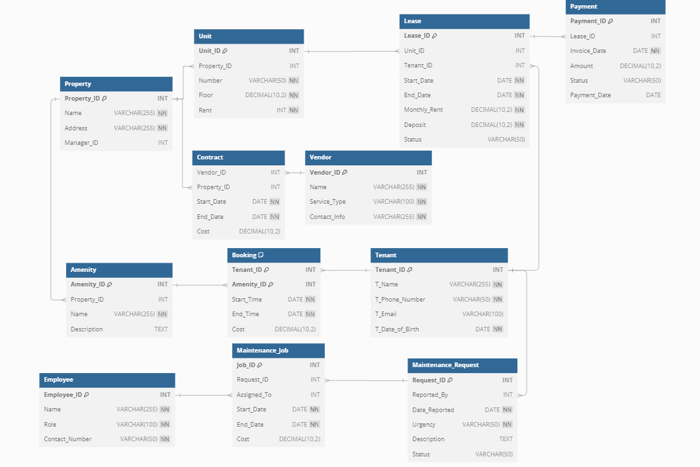

# Mini Apartment Management Project

## Objectives
This project aims to build a management system for a mini apartment complex, optimizing the management of apartments, residents, lease contracts, and maintenance requests. The system will help administrators easily track and handle information related to apartment rentals and maintenance.

## Description
The project utilizes MySQL for database management and Tableau for data visualization. The main functionalities of the system include:

- **Apartment Management**: Store information about apartments, including area, number of rooms, and available amenities.
- **Resident Management**: Store information about residents, including name, age, phone number, and email.
- **Lease Management**: Track lease contracts, including start date, end date, and contract status.
- **Maintenance Request Management**: Record and track maintenance requests from residents, including issue description and handling status.
- **Payment Management**: Track payments from residents, including amount, payment date, and payment status.

## Highlights
- **Using MySQL**: The system uses MySQL to manage the database, ensuring data integrity and efficiency in data storage and retrieval.
- **Triggers and Stored Procedures**: Utilize triggers and stored procedures to automate tasks and ensure data consistency. For example, the `check_lease_dates` trigger ensures the start date is always before the end date.
- **Data Visualization with Tableau**: Use Tableau to create reports and visual charts, helping administrators easily track and analyze data.
- **Automatic Lease Status Update**: The `update_lease_status` trigger automatically updates the lease status based on the end date, helping administrators easily track expired leases.
- **Comprehensive Management**: The system provides comprehensive management functions from apartments, residents, lease contracts, maintenance requests to payments, optimizing the management process.

## Relational Data Model


## Installation
1. **Clone the repository**:
    ```sh
    git clone <repository-url>
    cd <repository-directory>
    ```

2. **Install MySQL**:
    - Create the database and necessary tables by running the SQL scripts in the `sql` directory.

3. **Install Tableau**:
    - Use Tableau to connect to the MySQL database and create visual reports and charts.

## Usage
- **Apartment Management**: Add, edit, delete apartment information.
- **Resident Management**: Add, edit, delete resident information.
- **Lease Management**: Add, edit, delete, and track lease contract status.
- **Maintenance Request Management**: Record and track maintenance requests.
- **Payment Management**: Track payments from residents.

## Contribution
If you want to contribute to the project, please create a pull request or open a new issue to discuss the changes you want to make.
